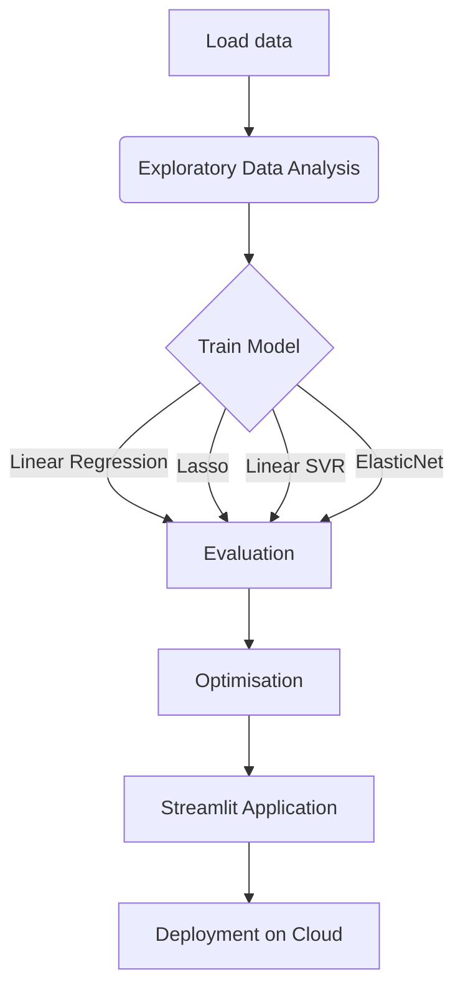

# Predicting an Insurance Premium: Assur'Aimant US Expansion

This project aims to help Assur'Aimant, a French insurer, estimate insurance premiums for its expansion in the United States. Currently, manual premium estimation is costly and time-consuming. This project uses machine learning to predict premiums based on customer demographics.

## Project Context

Assur'Aimant wants to modernize its insurance premium estimation process for the US market. We were commissioned to develop an AI solution capable of accurately predicting premiums based on customer characteristics. This project includes exploratory data analysis (EDA) and the construction of a predictive model.

## Data

The data collected from Assur'Aimant in Houston includes the following information:

- **`BMI`**: Body Mass Index (18.5 - 24.9 ideally).
- **`Sex`**: Gender of the subscriber (male or female).
- **`Age`**: Age of the primary beneficiary.
- **`Children`**: Number of dependent children covered by insurance.
- **`Smoker`**:  Smoking status (smoker or non-smoker).
- **`Region`**: Region of residence in the United States (Northeast, Southeast, Southwest, Northwest).
- **`Charges`**: Insurance premium billed (target variable).


## Objectives

1. **Exploratory Data Analysis (EDA):** Understanding data, identifying trends, outliers and relationships between variables. This includes:

    - Missing and duplicate values ​​check (with `missingno`).
    - Outlier detection.
    - Univariate and bivariate analysis.
    - Correlation analysis.
    - Hypothesis validation with statistical tests.
    - Visualizations with `seaborn` (box plots, violin plots, etc.).

2. **Predictive Modeling:**  Building a machine learning model to predict insurance premiums. This includes:

    - Creation of a base model (Dummy Model).
    - Data separation (80% training, 20% test).
    - Data preparation (logarithmic transformation if necessary, management of `random_state` and `seed`).
    - Model selection (`sklearn`: Linear Regression, Lasso, Ridge, ElasticNet or any model that performs best).
    - Model evaluation (R², RMSE).
    - Pre-processing (Standardization, encoding of categorical variables with `sklearn.pipeline.Pipeline`).
    - Optimization (`PolynomialFeatures`, `GridSearchCV`, `RandomSearchCV`).
    - Analysis and interpretation of results (importance of variables).

3. **Streamlit Application:** Develop an interactive application allowing:

    - User data entry.
    - Real-time insuranc charge prediction.
    - Use of a pre-trained model exported in `.pkl`.
    - Integration of pre-processing pipelines.

## Tools and Technologies

- Python
- `pandas`, `numpy`
- `scikit-learn`
- `seaborn`, `missingno`
- `streamlit`


## Projet files

1. `app.py` - Streamlit Application 
2. `data_cleaning.ipynb` - Data cleaning  
3. `data_analysis.ipynb` - Exploratory Data Analysis (EDA) 
4. `data_model.ipynb` - Model development and testing (model used for the steamlit app) 
5. `analyse.ipynb` - Cleaning / EDA / model building and testing 
6. `model.pkl` -  Exported trained model 
7. `README.md` - This file 
8. `requirements.txt` - Dependencies & packages 

## How to Run
Follow these steps to execute the project:

1. Ensure Python is installed on your system.
2. Clone this repository to your local machine:

```bash
git clone https://github.com/MichAdebayo/simplon_insurance_price_prediction.git
```
3. Navigate to the project directory:
```
cd simplon_insurance_price_prediction
```
4. Install the required dependencies:
```
pip install -r requirements.txt
```

5.  Running the Streamlit application

```bash
streamlit run app.py
```
### Note:
 If you wish to only test the app without cloning the repo, you can do so using [this](https://real-time-insurance-prediction.streamlit.app/) link. This is possible because the the application has been deployed on streamlit cloud.

### Project Worflow



## Authors

* Michael ADEBAYO [[GitHub](https://github.com/MichAdebayo)]
* Khadija AASSI [[GitHub](https://github.com/Khadaassi)]